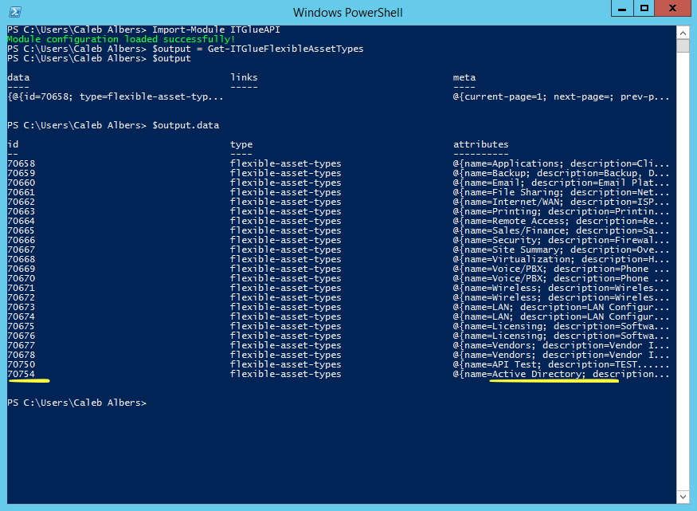
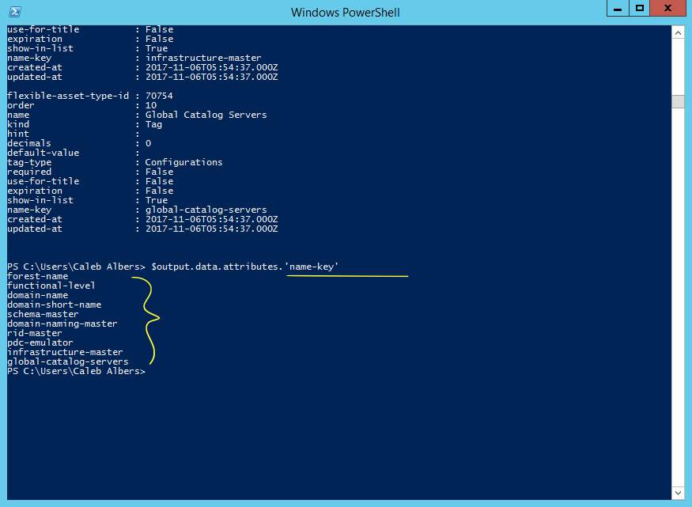

This document outlines the steps involved if you wish to utilize an existing Flexible Asset Type with the script, rather than creating a new one using the `Initialize-ActiveDirectoryFlexAsset.ps1` script.

# Instructions

This script makes use of a configuration file to hold neccessary data that the API needs to be able to create and modify flexible assets. In the simplest form, that configuration file looks like:

```posh
@{
    flex_asset_id = ''
    org_id = ''
    flexible_asset_type_id = ''

    key_name_ADForestName = ''
    key_name_ADFunctionalLevel = ''
    key_name_DomainName = ''
    key_name_DomainShortName = ''
    key_name_SchemaMaster = ''
    key_name_DomainNamingMaster = ''
    key_name_RIDMaster = ''
    key_name_PDCEmulator = ''
    key_name_InfrastructureMaster = ''
    key_name_GlobalCatalogServers = ''


}
```

The `flexible_asset_type_id` and all `key_name_<xxx>` variables have to be filled out, however this is a one-time process, as these values are the same across your entire IT Glue account (and all organizations under it). To start with, let's find out the `flexible_asset_type_id` by running the following code:

```posh
Import-Module ITGlueAPI

$output = Get-ITGlueFlexibleAssetTypes
$output.data
```

Your screen should look like this:



Find the `id` that corresponds to the Active Directory flex asset type. Now that we have found it, fill it out in your config file.

Next, let's find out what to put for the `key_name_<xxx>` variables by running the following code to see what fields are attributed to the Active Directory flex asset type:

```posh
$output = Get-ITGlueFlexibleAssetFields -flexible_asset_type_id <xxx> #insert your flex asset type id
$output.data.attributes
```


Each field should now be listed. In specific, the attribute we are looking for is called `name-key`. The data in this field is what we need to fill out our config file. For each element in the config file, fill out the corresponding `name-key` of the field returned by the aforementioned PowerShell commands.

To make it a bit easier, feel free to list all of the `name-key` values in one shot, just be careful to get the correct ones:

```posh
$output.data.attributes.'name-key'
```



For our example shown in the screenshots, the following is what we would expect our `key_name_<xxx>` elements to look like in our config file:

```posh
@{
    flex_asset_id = ''
    org_id = ''
    flexible_asset_type_id = 'xxxxx'

    key_name_ADForestName = 'forest-name'
    key_name_ADFunctionalLevel = 'functional-level'
    key_name_DomainName = 'domain-name'
    key_name_DomainShortName = 'domain-short-name'
    key_name_SchemaMaster = 'schema-master'
    key_name_DomainNamingMaster = 'domain-naming-master'
    key_name_RIDMaster = 'rid-master'
    key_name_PDCEmulator = 'pdc-emulator'
    key_name_InfrastructureMaster = 'infrastructure-master'
    key_name_GlobalCatalogServers = 'global-catalog-servers'


}
```

Once you are done, save your configuration file in the same directory as your script and make sure to pass the name of the file into the script using the `-api <string>` parameter if you want your script to automatically send data to IT Glue.