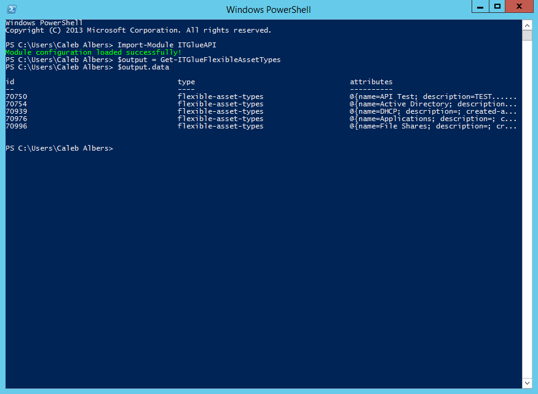
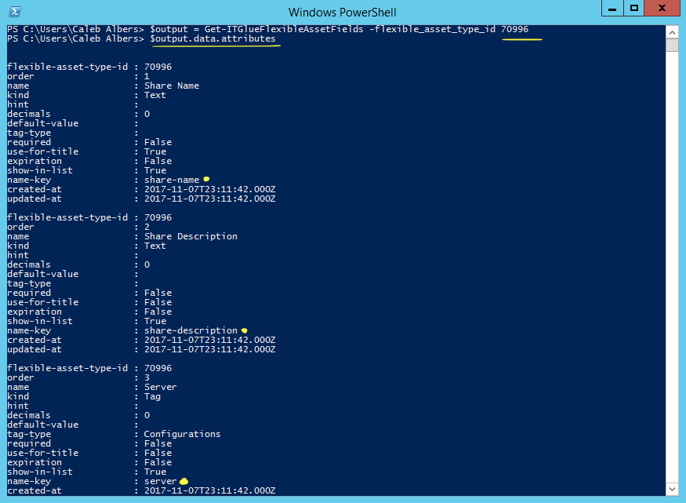
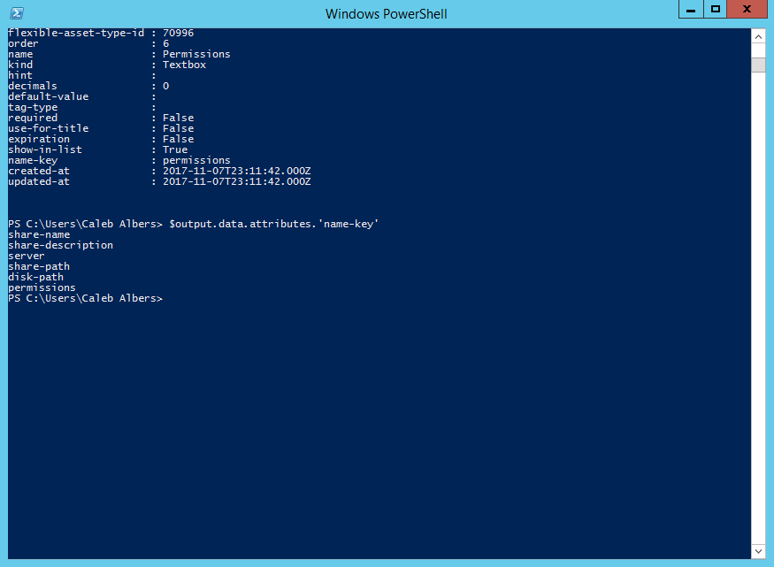

# File Share Documentation Automation

Getting accurate information for active file shares is crucial to properly support your clients. Let's look at a script that can automate the discovery of your file shares and create a Flex Asset in IT Glue to store the share information.

## Setup Instructions

:warning: If you intend to use this script's API functionality, make sure you have installed the [IT Glue PowerShell Module](https://github.com/itglue/powershellwrapper)

:warning: Make sure your File Share flexible asset type in IT Glue has fields corresponding to the ones outlined in `FileShares.flexasset`, as that is the data that this script is capable of finding.

This script makes use of a configuration file to hold neccessary data that the API needs to be able to create and modify flexible assets. In the simplest form, that configuration file looks like:

```posh
@{
    org_id = ''
    flexible_asset_type_id = ''

    key_name_ShareName = ''
    key_name_ShareDescription = ''
    key_name_Server = ''
    key_name_SharePath = ''
    key_name_DiskPath = ''
    key_name_Permissions = ''
}
```

The `flexible_asset_type_id` and all `key_name_<xxx>` variables have to be filled out, however this is a one-time process, as these values are the same across your entire IT Glue account (and all organizations under it). To start with, let's find out the `flexible_asset_type_id` by running the following code:

```posh
Import-Module ITGlueAPI

$output = Get-ITGlueFlexibleAssetTypes
$output.data
```

Your screen should look like this:



Find the `id` that corresponds to the File Share flex asset type. Now that we have found it, fill it out in your config file.

Next, let's find out what to put for the `key_name_<xxx>` variables by running the following code to see what fields are attributed to the File Share flex asset type:

```posh
$output = Get-ITGlueFlexibleAssetFields -flexible_asset_type_id <xxx> #insert your flex asset type id
$output.data.attributes
```



Each field should now be listed. In specific, the attribute we are looking for is called `name-key`. The data in this field is what we need to fill out our config file. For each element in the config file, fill out the corresponding `name-key` of the field returned by the aforementioned PowerShell commands.

To make it a bit easier, feel free to list all of the `name-key` values in one shot, just be careful to get the correct ones:

```posh
$output.data.attributes.'name-key'
```



For our example shown in the screenshots, the following is what we would expect our `key_name_<xxx>` elements to look like in our config file:

```posh
@{
    org_id = ''
    flexible_asset_type_id = 'xxxxx'

    key_name_ShareName = 'share-name'
    key_name_ShareDescription = 'share-description'
    key_name_Server = 'server'
    key_name_SharePath = 'share-path'
    key_name_DiskPath = 'disk-path'
    key_name_Permissions = 'permissions'
}
```

Once you are done, save your configuration file in the same directory as your script and make sure to pass the name of the file into the script using the `-api <string>` parameter if you want your script to automatically send data to IT Glue.

## Running the script for the first time

After following the setup instructions, it is time to run your script. There are a few things to note:

:warning: This script assumes that the servers it tags are in IT Glue as Configurations and that there is an exact name match. For example, if a file server is named "FS1", this script expects to have a configuration item in IT Glue under the current organization that has a name of "FS1". If this is not the case, the script will fail to appropriately create or update the flex asset.

Once your configuration file is appropriately set up, all you need to do is run the script with `.\FIleShares.ps1 -api api_config-FileShares.psd1` and the script will take care of the rest, including auto-updating the config document with the flexible asset id that is created.

NOTE: Every organization in IT Glue has a specific id attached to it. If you are unaware of the id for the organization or client you are getting AD information for, you are welcome to use the scripts `-organization <string>` parameter. For example, if I am running this script at a client who's name in IT Glue is `Happy Frog`, I can run the script with `.\FileShares.ps1 -api api_config-FileShares.psd1 -organization "Happy Frog"`, and the script will automatically find the organization id. Do note that it looks for an **exact** match for the organization name.

----

Documentation :heart: Automation!